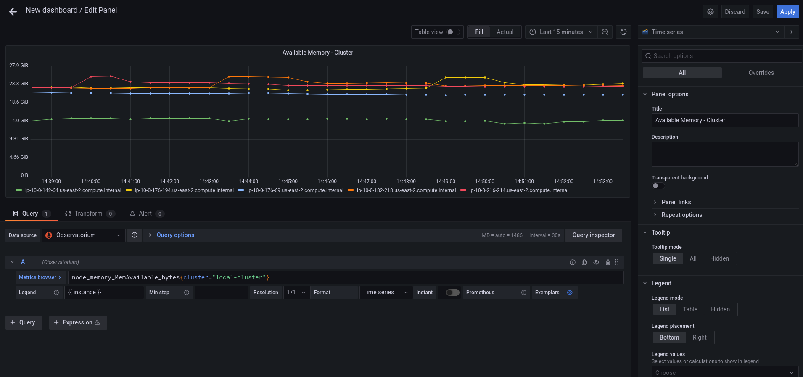

# Exercise 3 - Observability

In this exercise you enable and use the `Observability` function in Red Hat Advanced Cluster Management. You will configure observability, explore the built-in dashboards, enable custom alerts using Thanos Ruler and design custom dashboards for your own organizational needs.

### 3.1 - Deploying Observability

This part focuses on the `Observability` addon deployment. In order to deploy the functionality, you have to obtain an object storage provider. For this deployment you will use [minio](https://min.io/). A PVC will be assigned to a minio pod which will create a bucket and export an S3 object storage endpoint. The endpoint's information and credentials are exported in a secret with the `thanos-object-storage` name.

To create a namespace for the `MCO operator` to run in, run the next commands on the hub cluster -

```
<hub> $ oc login -u <admin-user> -p <password> https://api.cluster.2222.sandbox.opentlc.com:6443

<hub> $ oc new-project open-cluster-management-observability
```

To create the `minio` deployment run the next commands on the hub cluster -

```
<hub> $ git clone https://github.com/open-cluster-management/multicluster-observability-operator.git

<hub> $ oc apply -k multicluster-observability-operator/examples/minio/ -n open-cluster-management-observability
```

After running the command, a `minio` deployment will be available. The S3 endpoint is now exported in the `thanos-object-storage` secret.

```
<hub> $ oc extract secret/thanos-object-storage --to=- -n open-cluster-management-observability

# thanos.yaml
type: s3
config:
  bucket: "thanos"
  endpoint: "minio:9000"
  insecure: true
  access_key: "minio"
  secret_key: "minio123"
```

To create an instance of `Multi Cluster Obervability`, apply the next object to the  `open-cluster-management-observability` namespace on the hub cluster.

**NOTE** If you're not using an OpenShift cluster that's deployed on AWS, make sure to modify the StorageClass definition in the below YAML.

```
<hub> $ oc apply -f https://raw.githubusercontent.com/michaelkotelnikov/rhacm-workshop/master/03.Observability/exercise/multiclusterobservability.yaml -n open-cluster-management-observability
```

Make sure that both `multicluster-observability-operator` and `endpoint-operator` are deployed (all pods must be in `Running` state).

```
<hub> $ oc get pods -n open-cluster-management-observability

NAME                                                       READY   STATUS    RESTARTS   AGE
grafana-dev-5f9585d797-qnpms                               2/2     Running   0          27h
minio-79c7ff488d-wbzrm                                     1/1     Running   0          2d1h
observability-alertmanager-0                               3/3     Running   0          2d1h
observability-alertmanager-1                               3/3     Running   0          2d1h
observability-alertmanager-2                               3/3     Running   0          2d1h
observability-grafana-6556b6d979-n72hv                     2/2     Running   0          2d1h
observability-grafana-6556b6d979-rjf27                     2/2     Running   0          2d1h
observability-observatorium-api-84fd8849b7-f9bkv           1/1     Running   0          2d1h
observability-observatorium-api-84fd8849b7-z5b9r           1/1     Running   0          2d1h
observability-observatorium-operator-74975fc6fb-gl4pr      1/1     Running   0          2d1h
observability-rbac-query-proxy-66c4944d4d-9ptzp            2/2     Running   0          2d1h
observability-rbac-query-proxy-66c4944d4d-rkl9g            2/2     Running   0          2d1h
observability-thanos-compact-0                             1/1     Running   0          2d1h
observability-thanos-query-5bf8459f67-bgpzw                1/1     Running   0          2d1h
observability-thanos-query-5bf8459f67-rzwss                1/1     Running   0          2d1h
observability-thanos-query-frontend-d6bd84889-9n9kw        1/1     Running   0          2d1h
observability-thanos-query-frontend-d6bd84889-bvn9f        1/1     Running   0          2d1h
observability-thanos-query-frontend-memcached-0            2/2     Running   0          2d1h
observability-thanos-query-frontend-memcached-1            2/2     Running   0          2d1h
observability-thanos-query-frontend-memcached-2            2/2     Running   0          2d1h
observability-thanos-receive-controller-7c775bcdff-7b5gb   1/1     Running   0          2d1h
observability-thanos-receive-default-0                     1/1     Running   0          2d1h
observability-thanos-receive-default-1                     1/1     Running   0          2d1h
observability-thanos-receive-default-2                     1/1     Running   0          2d1h
observability-thanos-rule-0                                2/2     Running   0          27h
observability-thanos-rule-1                                2/2     Running   0          27h
observability-thanos-rule-2                                2/2     Running   0          27h
observability-thanos-store-memcached-0                     2/2     Running   0          2d1h
observability-thanos-store-memcached-1                     2/2     Running   0          2d1h
observability-thanos-store-memcached-2                     2/2     Running   0          2d1h
observability-thanos-store-shard-0-0                       1/1     Running   2          2d1h
observability-thanos-store-shard-1-0                       1/1     Running   2          2d1h
observability-thanos-store-shard-2-0                       1/1     Running   2          2d1h

<hub> $ oc get pods -n open-cluster-management-addon-observability

NAME                                              READY   STATUS    RESTARTS   AGE
endpoint-observability-operator-764b6c666-9s7nz   1/1     Running   0          2d1h
metrics-collector-deployment-765946868-hmk5d      1/1     Running   0          2d1h
```

Now, that all pods are running, log into RHACM's dashboard and navigate to **Cluster Lifecycle** -> **Grafana (top right side)**. Make sure that the dashboards are available and graphs are present.

### 3.2 - Explore the default Grafana dashboards

This part focuses on the default Grafana dashboards that come with RHACM. Each dashboard has its own characteristics and provides valueable information to a system administrator in the organization. This section contains multiple tasks that require you to look for certain values in the default dashboards that come with `MCO`.

- Find the maximum latency value for the `local-cluster` API server.
- Find out how much % of `local-cluster`'s memory is utilized.
- Find what is the size of the etcd database in `local-cluster`.
- Find the namespace that consumes the most CPU in `local-cluster`.
- Find what's the node in `local-cluster` that consumes the most % memory.
- Find what's the `apiserver` (openshift-apiserver namespace) pod CPU utulization and quota.

### 3.3 - Creating a custom alert

In this part you will configure custom alerts to monitor your environment. By configuring the alert, you will be able to receive a notification if a rule that you have configured is violated by one of managed clusters in RHACM.

#### 3.3.1 - Alert #1

The first alert you will configure in the exercise will initiate a notification when a cluster's memory utilization reaches over 20%. In order to create the alert, create the next ConfigMap in the `open-cluster-management-observability` namespace (Make sure to go through the alert before applying it!).

```
apiVersion: v1
data:
  custom_rules.yaml: |
    groups:
      - name: cluster-health
        rules:
        - alert: ClusterMemoryHighUsage
          annotations:
            summary: Notify when memory utilization on a cluster is greater than the defined utilization limit - 20%
            description: "The cluster has a high memory usage: {{ $value }} for {{ $labels.cluster }}."
          expr: |
            1 - sum(:node_memory_MemAvailable_bytes:sum) by (cluster) / sum(kube_node_status_allocatable{resource="memory"}) by (cluster) > 0.2
          for: 5s
          labels:
            cluster: "{{ $labels.cluster }}"
            severity: critical
kind: ConfigMap
metadata:
  name: thanos-ruler-custom-rules
  namespace: open-cluster-management-observability
```

Now that the alert is configured, check whether the alert is initiated or not. To check the alert, navigate to the Grafana instance you've deployed in the previous task. In the Grafana instance, go to the 'Explore' dashboard (compass icon on the left slidebar). Before checking whether the alert is initiated or not, run the alert's query to check the memory utilization in the `local-cluster` cluster. Copy the next expression to the `query` tab, and press `SHIFT + ENTER` to run the query.

```
1 - sum(:node_memory_MemAvailable_bytes:sum) by (cluster) / sum(kube_node_status_allocatable{resource="memory"}) by (cluster)
```

The result is a number that identifies the % of memory utilization of a cluster. For example, if the result is `0.1`, the memory utilization of a cluster is `10%`.

Try running the next query -

```
1 - sum(:node_memory_MemAvailable_bytes:sum) by (cluster) / sum(kube_node_status_allocatable{resource="memory"}) by (cluster) > 0.2
```

The query checks whether the result of the previous query is more than `0.2` (20%). If the query checks out, it will present all clusters that utilize more than 20% of their memory - in your case, its only `local-cluster`.

Now that you understand the mechanism behind alerting, try running a query that displays the active alerts in your environment. The query should display the alert that you've configured in the previous steps. Copy the next expression to the `query` tab, and press `SHIFT + ENTER` to run it.

```
ALERTS{alertname="ClusterMemoryHighUsage"}
```

The initiated alert should now appear.

#### 3.3.2 - Alert #2

The second alert will monitor the etcd database size. An alert will be initiated if the etcd database size in `local-cluster` reaches more than 100MiB. This time, you will create the alert expression by yourself (HINT: you can use the ACM - Clusters Overview dashboard for help).

In order to deploy the second alert to `MCO` add the new alert definition to the `ConfigMap` you have created for the previous alert. The ConfigMap should look like -

```
apiVersion: v1
data:
  custom_rules.yaml: |
    groups:
      - name: cluster-health
        rules:
        - alert: ClusterMemoryHighUsage
          annotations:
            summary: Notify when memory utilization on a cluster is greater than the defined utilization limit - 20%
            description: "The cluster has a high memory usage: {{ $value }} for {{ $labels.cluster }}."
          expr: |
            1 - sum(:node_memory_MemAvailable_bytes:sum) by (cluster) / sum(kube_node_status_allocatable{resource="memory"}) by (cluster) > 0.2
          for: 5s
          labels:
            cluster: "{{ $labels.cluster }}"
            severity: critical
        - alert: ExampleSecondAlert
          annotations:
            summary: Example Summary
            description: "Example description"
          expr: |
            ...
kind: ConfigMap
metadata:
  name: thanos-ruler-custom-rules
  namespace: open-cluster-management-observability
```

Make sure that the alert works as expected.

### 3.4 - Creating a custom dashboard

In this section you will add your own dashboard to the default dashboards that come with MCO. 

Before you can create a custom dashboard, you need to spin up an instance of a "Development Grafana" in which you'll design your dashboard. Follow the steps described in slides 84 and 85 in the [workshop's presentation](https://docs.google.com/presentation/d/1LCPvIT_nF5hwnrfYdlD0Zie4zdDxc0kxZtW3Io5jfFk/edit?usp=sharing) to create the development instance of Grafana.

**NOTE** Make sure to log into the Grafana Dev instance with the wanted `admin` user before you run the `./switch-to-grafana-admin.sh` script!


#### 3.4.1 - Panel #1 - Available memory per node

The dashboard you design in this part will present a graph that aggregates all available nodes in all clusters and show their available memory over a defined time period. In order to configure that dashboard, follow the next steps -

- Log into the development instance.
- Press on the large `+` on the left slidebar, select `Dashboard`. 
- Press on `Add new panel` in order to create a custom graph.
- Enter the next query in the `metrics` tab `node_memory_MemAvailable_bytes{cluster="local-cluster"}`.
- Enter the next label into the `Legend` field - `{{ instance }}`.
- In the right menu, scroll down to the `Standard options` section. In the `Unit` section, select `Data` -> `bytes (IEC)`.
- In the same menu, add `0` to the `Min` key.
- In the top of the right menu, provide your panel with a name at - `Panel title`.
- Press on `Apply` at the top right end of the screen.
- You have created your first panel!



#### 3.4.2 - Panel #2 - Available CPU per node

For this panel, you will create a same graph like in the previous section, but this time, you will monitor the node's available CPU. While creating the panel, make sure that you use the correct `Units`.


Make sure that you get the correct values by running the next command on the hub cluster -

```
<hub> $ oc adm top node
NAME                                         CPU(cores)   CPU%   MEMORY(bytes)   MEMORY%   
ip-10-0-138-131.us-east-2.compute.internal   2064m        27%    10496Mi         34%       
ip-10-0-148-108.us-east-2.compute.internal   3259m        21%    11826Mi         19%       
ip-10-0-166-190.us-east-2.compute.internal   7359m        47%    16188Mi         26%       
ip-10-0-186-66.us-east-2.compute.internal    1786m        23%    8773Mi          28%       
ip-10-0-202-11.us-east-2.compute.internal    1754m        23%    8781Mi          28%  
```

#### 3.4.3 - Export the dashboard to the main Grafana instance

Until now, you have worked on the "Development" Grafana instance. It's time to export the dashboard you've created to the main "Production" Grafana instance. Before you begin the export process, make sure to save your dashboard by pressing `CTRL + S`. Provide the dashboard with a simple, declerative name.

To export the dashboard to the "Production" instance, follow the steps described in slide 86 in the [workshop's presentation](https://docs.google.com/presentation/d/1LCPvIT_nF5hwnrfYdlD0Zie4zdDxc0kxZtW3Io5jfFk/edit?usp=sharing).

Make sure that the dashboard is available in the Production Grafana instance in the 'Custom' directory.
