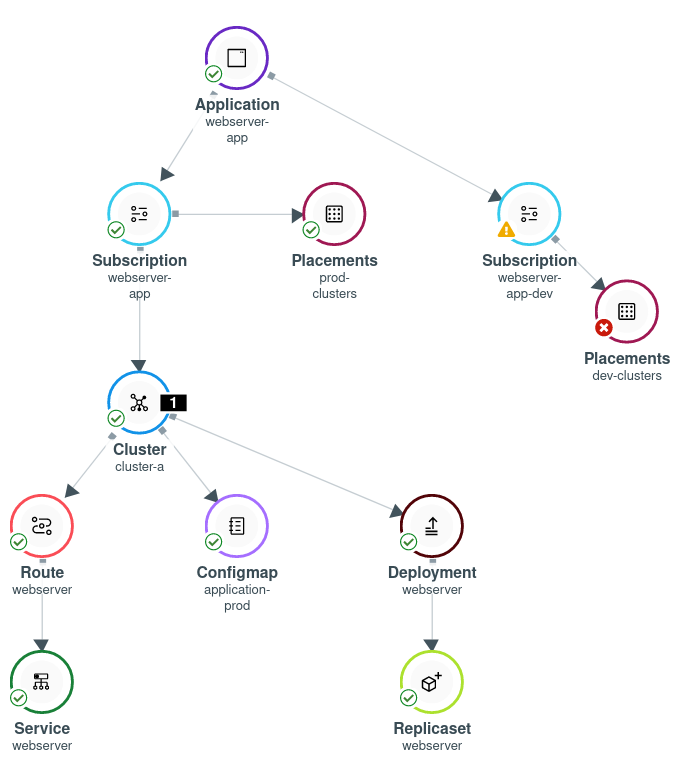
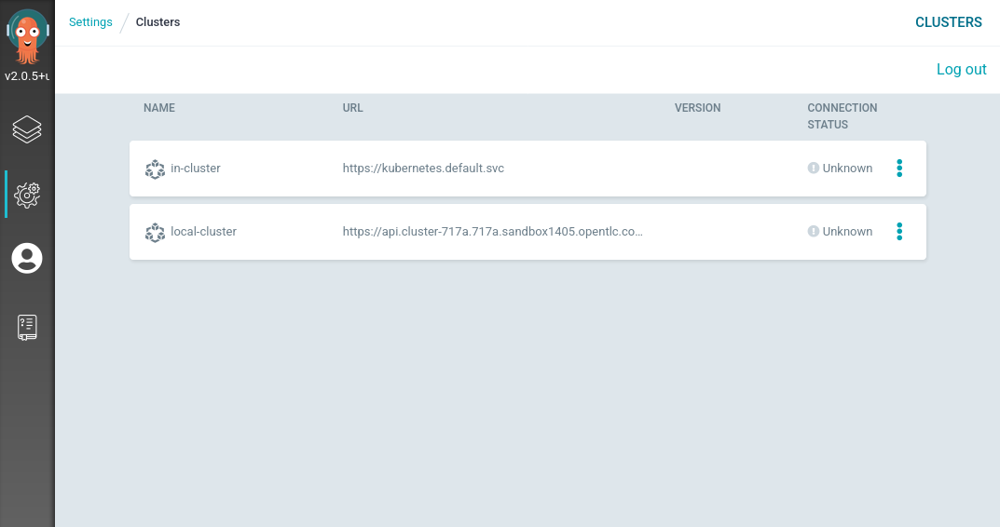
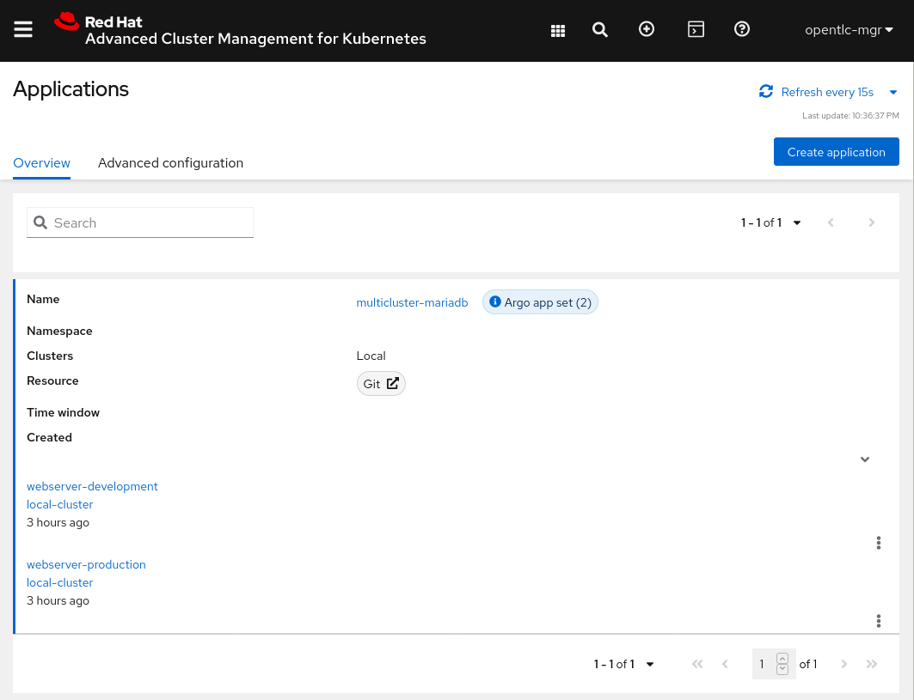
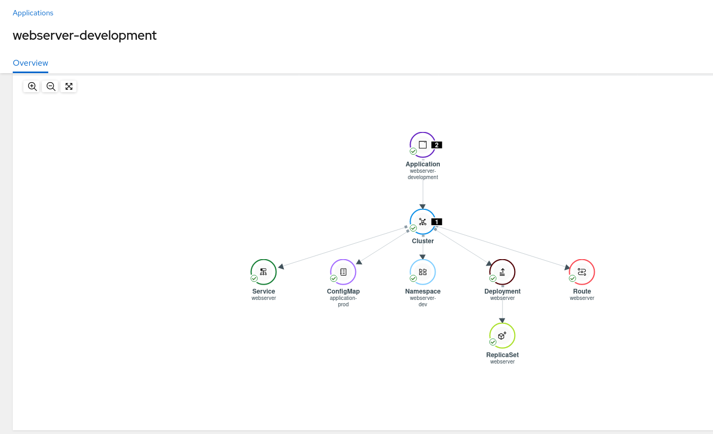

# Exercise 4 - Application Lifecycle

In this exercise you will deploy a demo application onto the cluster using Red Hat Advanced Cluster Management for Kubernetes. You will manage the application versions and use cluster labels to configure placement mechanisms.

In this exercise you will try to deploy an application that manages two versions -

* Development - [https://github.com/michaelkotelnikov/rhacm-workshop/tree/dev/04.Application-Lifecycle/exercise-application/application-resources](https://github.com/michaelkotelnikov/rhacm-workshop/tree/dev/04.Application-Lifecycle/exercise-application/application-resources)
* Production - [https://github.com/michaelkotelnikov/rhacm-workshop/tree/master/04.Application-Lifecycle/exercise-application/application-resources](https://github.com/michaelkotelnikov/rhacm-workshop/tree/master/04.Application-Lifecycle/exercise-application/application-resources)

Both versions of the application are stored in the same Git repository, while the **production** version is stored in the **master** branch, and the **development** version is stored in the **dev** branch.

The Application is a simple web application that provides a different output in each version. The **development** application will provide a web page, while the **production** application will provide a different web page.

Each version of the application will run on a cluster with the relevant tag. The application with the **development** version will run on clusters with the **environment=dev** label, while the application with the **production** version will run on clusters with the **environment=production** label. 

To achieve a functioning application create the next resources -

* **Namespace** - Create a namespace in which the custom resources are going to be deployed on the hub.

```
<hub> $ cat >> namespace.yaml << EOF
---
apiVersion: v1
kind: Namespace
metadata:
  name: webserver-acm
EOF

<hub> $ oc apply -f namespace.yaml
```


* **Channel** - Create a channel that refers to the GitHub repository in which the application’s resources are placed. The GitHub repository is at - [https://github.com/michaelkotelnikov/rhacm-workshop.git](https://github.com/michaelkotelnikov/rhacm-workshop.git)

```
<hub> $ cat >> channel.yaml << EOF
---
apiVersion: apps.open-cluster-management.io/v1
kind: Channel
metadata:
  name: webserver-app
  namespace: webserver-acm
spec:
  type: Git
  pathname: https://github.com/michaelkotelnikov/rhacm-workshop.git
EOF

<hub> $ oc apply -f channel.yaml
```


* **PlacementRule** - Create a PlacementRule that aggregates all clusters with the **environment=dev** label. This PlacementRule will be used to group all clusters that will run the development version of the application.

```
<hub> $ cat >> placementrule-dev.yaml << EOF
---
apiVersion: apps.open-cluster-management.io/v1
kind: PlacementRule
metadata:
  name: dev-clusters
  namespace: webserver-acm
spec:
  clusterConditions:
    - type: ManagedClusterConditionAvailable
      status: "True"
  clusterSelector:
    matchLabels:
      environment: dev
EOF

<hub> $ oc apply -f placementrule-dev.yaml
```

* **Subscription** - Create a subscription that binds between the defined above **PlacementRule** and **Channel** resources. The subscription will point to the relevant path on which the application resources are present - _04.Application-Lifecycle/exercise-application/application-resources_. Furthermore, the Subscription will point to the **dev** branch, in order to deploy the development version of the application.

```
<hub> $ cat >> subscription-dev.yaml << EOF
---
apiVersion: apps.open-cluster-management.io/v1
kind: Subscription
metadata:
  name: webserver-app-dev
  namespace: webserver-acm
  labels:
    app: webserver-app
  annotations:
    apps.open-cluster-management.io/github-path: 04.Application-Lifecycle/exercise-application/application-resources
    apps.open-cluster-management.io/git-branch: dev
spec:
  channel: webserver-acm/webserver-app
  placement:
    placementRef:
      kind: PlacementRule
      name: dev-clusters
EOF

<hub> $ oc apply -f subscription-dev.yaml 
```

* **Application** - Create an Application resource to aggregate Subscription resources. The Application resource aggregates the Subscription resources by using labels. In this case, you will be using the label - **app: webserver-app**.

```
<hub> $ cat >> application.yaml << EOF
---
apiVersion: app.k8s.io/v1beta1
kind: Application
metadata:
  name: webserver-app
  namespace: webserver-acm
spec:
  componentKinds:
  - group: apps.open-cluster-management.io
    kind: Subscription
  descriptor: {}
  selector:
    matchExpressions:
    - key: app
      operator: In
      values:
      - webserver-app
EOF

<hub> $ oc apply -f application.yaml 
```

After the resources are created. In the RHACM portal, navigate to **Applications** -> **&lt;application name>**. Make sure that the resources are created.

Run the next command on the managed cluster -

```
<managed> $ oc get route -n webserver-acm
```

Navigate to the application's frontend at **https://&lt;route-url>/application.html**

Make sure that the application is running the **development version** on the cluster. Validate that the application is deployed by running the next command -

```
<managed cluster> $ oc get pods -n webserver-acm
```

Now that you have the **Development** version of the application running, it’s time to deploy the **Production** version alongside the **Development** version. Create the next resources -

* **PlacementRule** - Create a PlacementRule that aggregates the **production** clusters using the **environment=production** label.

```
<hub> $ cat >> placementrule-production.yaml << EOF
---
apiVersion: apps.open-cluster-management.io/v1
kind: PlacementRule
metadata:
  name: prod-clusters
  namespace: webserver-acm
spec:
  clusterConditions:
    - type: ManagedClusterConditionAvailable
      status: "True"
  clusterSelector:
    matchLabels:
      environment: production
EOF

<hub> $ oc apply -f placementrule-production.yaml
```

*   **Subscription** - Create a Subscription that maps the newly created **PlacementRule** to the previously created **Channel**. The subscription uses the **master** branch in the **Channel** in order to run the **production** version of the application.

```
<hub> $ cat >> subscription-production.yaml << EOF
---
apiVersion: apps.open-cluster-management.io/v1
kind: Subscription
metadata:
  name: webserver-app-prod
  namespace: webserver-acm
  labels:
    app: webserver-app
  annotations:
    apps.open-cluster-management.io/github-path: 04.Application-Lifecycle/exercise-application/application-resources
spec:
  channel: webserver-acm/webserver-app
  placement:
    placementRef:
      kind: PlacementRule
      name: prod-clusters
EOF

<hub> $ oc apply -f subscription-production.yaml
```

After creating the resources,  navigate to **Applications** -> **webserver-app**. On the left, at the `Subscription` sidebar, choose `All Subscriptions`. Note that the newly created Subscription does not deploy any resource on any of the clusters since there are no clusters with the **environment=production** label.


In order to deploy the production application on **local-cluster** -

*   navigate to **Clusters** -> **local-cluster** -> **Actions** -> **Edit labels**.
*   Remove the **environment=dev** label.
*   Add the **environment=production** label.

Wait for about 2 minutes for the application to redeploy on **local-cluster**, and navigate to **Applications** -> **webserver-app**.

Note that the application is now deployed at its “production” version on **local-cluster**.



Click on the application’s route resource, and navigate to **https://&lt;route-url>/application.html**. The application now serves a different webpage, indicating that the application is in a production state.

**NOTE:** All of the resources you have configured in this exercise are present in the [git repository](https://github.com/michaelkotelnikov/rhacm-workshop.git). The resources can be created by running the next command -

```
<hub> $ oc apply -f https://raw.githubusercontent.com/michaelkotelnikov/rhacm-workshop/master/04.Application-Lifecycle/exercise-application/rhacm-resources/application.yaml
```

# ArgoCD Integration

This section discusses the process of deploying an application using ArgoCD in an Advanced Cluster Management for Kubernetes environment. The section will follow the process of ArgoCD installation, integration with RHACM and application deployment.

Before you begin, make sure to delete all of the resources you created in the previous exercise -

```
<hub> $ oc delete project webserver-acm
```

## ArgoCD Installation

As described in the workshop. An ArgoCD / OpenShift GitOps instance has to be installed in order to begin the integration with RHACM. Install the `openshift-gitops` operator by applying the next resource to the hub cluster -

```
<hub> $ cat >> openshift-gitops-operator.yaml << EOF
---
apiVersion: operators.coreos.com/v1alpha1
kind: Subscription
metadata:
  name: openshift-gitops-operator
  namespace: openshift-operators
spec:
  channel: stable
  installPlanApproval: Automatic
  name: openshift-gitops-operator
  source: redhat-operators
  sourceNamespace: openshift-marketplace
EOF

<hub> $ oc apply -f openshift-gitops-operator.yaml
```

After installing the operator on the hub cluster. Create the ArgoCD CustomResource. The ArgoCD CR spins an instance of ArgoCD using the `openshift-gitops` operator.

```
<hub> $ cat >> argocd.yaml << EOF
---
apiVersion: argoproj.io/v1alpha1
kind: ArgoCD
metadata:
  finalizers:
    - argoproj.io/finalizer
  name: openshift-gitops
  namespace: openshift-gitops
spec:
  server:
    autoscale:
      enabled: false
    grpc:
      ingress:
        enabled: false
    ingress:
      enabled: false
    resources:
      limits:
        cpu: 500m
        memory: 256Mi
      requests:
        cpu: 125m
        memory: 128Mi
    route:
      enabled: true
    service:
      type: ''
  grafana:
    enabled: false
EOF

<hub> $ oc apply -f argocd.yaml
```

Make sure that the ArgoCD instance is running by navigating to ArgoCD's web UI. The URL can be found be running the next command -

```
<hub> $ oc get route -n openshift-gitops
NAME                      HOST/PORT                                  PATH   SERVICES                  PORT    TERMINATION            WILDCARD
...
openshift-gitops-server   openshift-gitops-server-openshift-gitops.<FQDN>   openshift-gitops-server   https   passthrough/Redirect   None
```

Log into the ArgoCD instance by pressing on `Log In via OpenShift`.

Now that you have a running instance of ArgoCD, let's integrate it with RHACM!

## Preparing RHACM for ArgoCD Integration

In this part you will create the resources to import `local-cluster` into ArgoCD's managed clusters.

Create the next ManagedClusterSet resource. The ManagedClusterSet resource will include the `local-cluster` cluster. The ManagedClusterSet resource is associated with the `openshift-gitops` namespace.

```
<hub> $ cat >> managedclusterset.yaml << EOF
---
apiVersion: cluster.open-cluster-management.io/v1beta1
kind: ManagedClusterSet
metadata:
  name: all-clusters
EOF

<hub> $ oc apply -f managedclusterset.yaml
```

Now, import `local-cluster` into the ManagedClusterSet resource. Importation will be done by adding the `cluster.open-cluster-management.io/clusterset: all-clusters` label to the `local-cluster` ManagedCluster resource -

```
<hub> $ oc edit managedcluster local-cluster
...
labels:
...
    cloud: Amazon
    cluster.open-cluster-management.io/clusterset: all-clusters
...
```

Create the ManagedClusterSetBinding resource to bind the `local-cluster` ManagedClusterSet resource to the `openshift-gitops` resource. Creating the ManagedClusterSetBinding resource will allow ArgoCD to access `local-cluster` information and import it into its management stack.

```
<hub> $ cat >> managedclustersetbinding.yaml << EOF
---
apiVersion: cluster.open-cluster-management.io/v1beta1
kind: ManagedClusterSetBinding
metadata:
  name: all-clusters
  namespace: openshift-gitops
spec:
  clusterSet: all-clusters
EOF

<hub> $ oc apply -f managedclustersetbinding.yaml
```

Create the Placement resource and bind it to `all-clusters` ManagedClusterSet. Note that you will not be using any special filters in this exercise.

```
<hub> $ cat >> placement.yaml << EOF
---
apiVersion: cluster.open-cluster-management.io/v1alpha1
kind: Placement
metadata:
  name: all-clusters
  namespace: openshift-gitops
spec:
  clusterSets:
    - all-clusters
EOF

<hub> $ oc apply -f placement.yaml
```

Create the GitOpsServer resource to indicate the location of ArgoCD and the placement resource -

```
<hub> $ cat >> gitopsserver.yaml << EOF
---
apiVersion: apps.open-cluster-management.io/v1beta1
kind: GitOpsCluster
metadata:
  name: gitops-cluster
  namespace: openshift-gitops
spec:
  argoServer:
    cluster: local-cluster
    argoNamespace: openshift-gitops
  placementRef:
    kind: Placement
    apiVersion: cluster.open-cluster-management.io/v1alpha1
    name: all-clusters
EOF

<hub> $ oc apply -f gitopsserver.yaml
```

Make sure that `local cluster` is imported into ArgoCD. In ArgoCD's web UI, on the left menu bar, navigate to **Manage your repositories, projects, settings** -> **Clusters**. You should see `local-cluster` in the cluster list.



## Deploying an ApplicationSet using ArgoCD

Now that you integrated ArgoCD with RHACM, let's deploy an ApplicationSet resource using ArgoCD. The applications you're going to create in this part are based on the same applications you have created in the beginning of the exercise - One web server application for a development environment and one for a production environment.

The applications are based on one [helm](https://helm.sh/) chart. Each application in the set is identified by its own unique `values.yaml` file. The applications are using the same baseline kubernetes resources at - [exercise-argocd/application-resources/templates](exercise-argocd/application-resources/templates), but they are using different `values` files at - [exercise-argocd/application-resources/values](exercise-argocd/application-resources/values). Each instance of the application uses a separate values set. The ApplicationSet resource iterates over the directories in the [exercise-argocd/application-resources/values](exercise-argocd/application-resources/values) directory and creates an instance of an application for each directory name.

To create the ApplicationSet resource run the next commands -

```
<hub> $ oc apply -f https://raw.githubusercontent.com/michaelkotelnikov/rhacm-workshop/master/04.Application-Lifecycle/exercise-argocd/argocd-resources/appproject.yaml

<hub> $ oc apply -f https://raw.githubusercontent.com/michaelkotelnikov/rhacm-workshop/master/04.Application-Lifecycle/exercise-argocd/argocd-resources/applicationset.yaml
```

Note that two application instances have been created in the ArgoCD UI -


After viewing the applications and their resources in the ArgoCD dashboard, log into RHACM's web console, and navigate to **Applications**. Note that RHACM identifies the deployed ApplicationSet and provides an entry for both applications -



The deployed application resources can be seen in the ApplicationSet instance in RHACM -



Make sure that the application is available by navigating to its Route resource.

```
<hub> $ oc get route -n webserver-prod

NAME        HOST/PORT                              PATH                SERVICES    PORT       TERMINATION   WILDCARD
webserver   webserver-webserver-prod.apps.<FQDN>   /application.html    webserver   8080-tcp   edge          None
```
