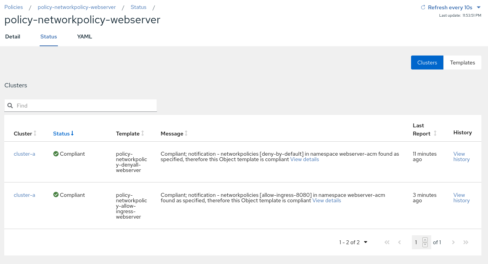

# Exercise 4 - Governance Risk and Compliance

In this exercise you will go through the Compliance features that come with Red Hat Advanced Cluster Management for Kubernetes. You will apply a number of policies to the managed cluster in order to comply with global security and management standards.

Before you start creating the policies, make sure to create a namespace to populate the CRs that associate with RHACM policies.

```
<hub> $ cat >> policies-namespace.yaml << EOF
---
apiVersion: v1
kind: Namespace
metadata:
  name: rhacm-policies
EOF

<hub> $ oc apply -f policies-namespace.yaml
```

After the namespace is created, create a PlacementRule resource. We will use the PlacementRule to associate the below policies with all clusters that are associated with the environment=production label.

```
<hub> $ cat >> placementrule-policies.yaml << EOF
---
apiVersion: apps.open-cluster-management.io/v1
kind: PlacementRule
metadata:
  name: prod-policies-clusters
  namespace: rhacm-policies
spec:
  clusterConditions:
    - type: ManagedClusterConditionAvailable
      status: "True"
  clusterSelector:
    matchLabels:
      environment: production
EOF

<hub> $ oc apply -f placementrule-policies.yaml
```

## Policy #1 - Network Security

In this section you will apply a NetworkPolicy object onto the managed cluster in order to limit access to the application you have created in the previous exercise. You will only allow traffic that comes from OpenShift’s Ingress Controller in port 8080. All other traffic will be dropped.

The policy you’ll create in this section will use the _enforce_ remediation action in order to create the NetworkPolicy objects if they do not exist.

We will configure the policy definition in two stages -


### Stage 1 - Deny all traffic to the application namespace

The policy you will configure in this section is enforcing a _deny all_ NetworkPolicy in the webserver-acm namespace on cluster-a. A _deny all_ NetworkPolicy object example -

```
kind: NetworkPolicy
apiVersion: networking.k8s.io/v1
metadata:
  name: deny-by-default
spec:
  podSelector:
  ingress: []
```

In order to create a _deny all_ NetworkPolicy object on _cluster-a_ using Red Hat Advanced Cluster Management for Kubernetes, apply the next commands to the hub cluster -

```
<hub> $ cat >> denyall-networkpolicy-policy.yaml << EOF
---
apiVersion: policy.open-cluster-management.io/v1
kind: Policy
metadata:
  name: policy-networkpolicy-webserver
  namespace: rhacm-policies
  annotations:
    policy.open-cluster-management.io/standards: NIST SP 800-53
    policy.open-cluster-management.io/categories: SC System and Communications Protection
    policy.open-cluster-management.io/controls: SC-7 Boundary Protection
spec:
  remediationAction: enforce
  disabled: false
  policy-templates:
    - objectDefinition:
        apiVersion: policy.open-cluster-management.io/v1
        kind: ConfigurationPolicy
        metadata:
          name: policy-networkpolicy-denyall-webserver
        spec:
          remediationAction: enforce # the policy-template spec.remediationAction is overridden by the preceding parameter value for spec.remediationAction.
          severity: medium
          namespaceSelector:
            include: ["webserver-acm"]
          object-templates:
            - complianceType: musthave
              objectDefinition:
                kind: NetworkPolicy
                apiVersion: networking.k8s.io/v1
                metadata:
                  name: deny-by-default
                spec:
                  podSelector:
                  ingress: []
---
apiVersion: policy.open-cluster-management.io/v1
kind: PlacementBinding
metadata:
  name: binding-policy-networkpolicy-webserver
  namespace: rhacm-policies
placementRef:
  name: prod-policies-clusters
  kind: PlacementRule
  apiGroup: apps.open-cluster-management.io
subjects:
- name: policy-networkpolicy-webserver
  kind: Policy
  apiGroup: policy.open-cluster-management.io
EOF

<hub> $ oc apply -f denyall-networkpolicy-policy.yaml
```

The above command creates two objects _Policy_ and _PlacementBinding_.

* The _Policy_ objects define the NetworkPolicy that will be deployed on cluster-a. It associates the NetworkPolicy to the webserver-acm namespace, and enforces it.
* The _PlacementRule_ resource associates the _Policy_ object with the _PlacementRule _resource that was created in the beginning of the exercise. Thereby, allowing the Policy to apply to all clusters with the _environment=production_ label.

After the creation of the objects, navigate to **Governance Risk and Compliance** in the Red Hat Advanced Cluster Management for Kubernetes console. Note that the policy is configured, and cluster-a is compliant.

Make sure that the policy is effective by trying to navigate to the application once again - **https://&lt;webserver application route>/application.html**. (The application should not be accessible).

### Stage 2 - Allow traffic from the Ingress Controller

In this section, you will modify the policy you have created in the previous section. You will add another ObjectDefinition entry to the policy. The ObjectDefinition will apply a second NetworkPolicy object onto the webserver-acm namespace in cluster-a. The NetworkPolicy object will allow traffic from the Ingress Controller to reach the webserver application in port 8080. An example definition of the NetworkPolicy object -

```
apiVersion: networking.k8s.io/v1
kind: NetworkPolicy
metadata:
  name: allow-from-openshift-ingress
spec:
  ingress:
  - ports:
    - protocol: TCP
      port: 8080
  - from:
    - namespaceSelector:
        matchLabels:
          network.openshift.io/policy-group: ingress
  podSelector: {}
  policyTypes:
  - Ingress
```

Adding the NetworkPolicy to the existing policy can be done by running the next command -

```
<hub> $ cat >> networkpolicy-policy.yaml << EOF
---
apiVersion: policy.open-cluster-management.io/v1
kind: Policy
metadata:
  name: policy-networkpolicy-webserver
  namespace: rhacm-policies
  annotations:
    policy.open-cluster-management.io/standards: NIST SP 800-53
    policy.open-cluster-management.io/categories: SC System and Communications Protection
    policy.open-cluster-management.io/controls: SC-7 Boundary Protection
spec:
  remediationAction: enforce
  disabled: false
  policy-templates:
    - objectDefinition:
        apiVersion: policy.open-cluster-management.io/v1
        kind: ConfigurationPolicy
        metadata:
          name: policy-networkpolicy-denyall-webserver
        spec:
          remediationAction: enforce # the policy-template spec.remediationAction is overridden by the preceding parameter value for spec.remediationAction.
          severity: medium
          namespaceSelector:
            include: ["webserver-acm"]
          object-templates:
            - complianceType: musthave
              objectDefinition:
                kind: NetworkPolicy
                apiVersion: networking.k8s.io/v1
                metadata:
                  name: deny-by-default
                spec:
                  podSelector:
                  ingress: []
    - objectDefinition:
        apiVersion: policy.open-cluster-management.io/v1
        kind: ConfigurationPolicy
        metadata:
          name: policy-networkpolicy-allow-ingress-webserver
        spec:
          remediationAction: enforce # the policy-template spec.remediationAction is overridden by the preceding parameter value for spec.remediationAction.
          severity: medium
          namespaceSelector:
            include: ["webserver-acm"]
          object-templates:
            - complianceType: musthave
              objectDefinition:
                kind: NetworkPolicy
                apiVersion: networking.k8s.io/v1
                metadata:
                  name: allow-ingress-8080
                spec:
                  ingress:
                  - ports:
                    - protocol: TCP
                      port: 8080
                  - from:
                    - namespaceSelector:
                        matchLabels:
                          network.openshift.io/policy-group: ingress
                  podSelector: {}
                  policyTypes:
                  - Ingress
---
apiVersion: policy.open-cluster-management.io/v1
kind: PlacementBinding
metadata:
  name: binding-policy-networkpolicy-webserver
  namespace: rhacm-policies
placementRef:
  name: prod-policies-clusters
  kind: PlacementRule
  apiGroup: apps.open-cluster-management.io
subjects:
- name: policy-networkpolicy-webserver
  kind: Policy
  apiGroup: policy.open-cluster-management.io
EOF

<hub> $ oc apply -f networkpolicy-policy.yaml
```

After applying the above policy, the application will be reachable from OpenShift’s ingress controller only. Any other traffic will be dropped.

Make sure that cluster-a is compliant to the policy by navigating to **Governance Risk and Compliance** in the Red Hat Advanced Cluster Management for Kubernetes console.



Make sure that the application is accessible now at - **https://&lt;webserver application route>/application.html**.

## Policy #2 - Quota Management

In this section you will apply a LimitRange object onto the managed cluster in order to limit the application’s resource consumption. You will configure a LimitRange object that limits the application’s container memory to 512Mb.

The policy you will create defines the next LimitRange object in the webserver-acm namespace -

```
apiVersion: v1
kind: LimitRange # limit memory usage
metadata:
  name: webserver-limit-range
spec:
  limits:
  - default:
      memory: 512Mi
      defaultRequest:
      memory: 256Mi
      type: Container
```

In order to apply the LimitRange object to cluster-a using Red Hat Advanced Cluster Management for Kubernetes, run the next commands -

```
<hub> $ cat >> limitrange-policy.yaml << EOF
apiVersion: policy.open-cluster-management.io/v1
kind: Policy
metadata:
  name: policy-limitrange
  namespace: rhacm-policies
  annotations:
    policy.open-cluster-management.io/standards: NIST SP 800-53
    policy.open-cluster-management.io/categories: SC System and Communications Protection
    policy.open-cluster-management.io/controls: SC-6 Resource Availability
spec:
  remediationAction: enforce
  disabled: false
  policy-templates:
    - objectDefinition:
        apiVersion: policy.open-cluster-management.io/v1
        kind: ConfigurationPolicy
        metadata:
          name: policy-limitrange-example
        spec:
          remediationAction: enforce # the policy-template spec.remediationAction is overridden by the preceding parameter value for spec.remediationAction.
          severity: medium
          namespaceSelector:
            include: ["webserver-acm"]
          object-templates:
            - complianceType: musthave
              objectDefinition:
                apiVersion: v1
                kind: LimitRange # limit memory usage
                metadata:
                  name: webserver-limit-range
                spec:
                  limits:
                  - default:
                      memory: 512Mi
                    defaultRequest:
                      memory: 256Mi
                    type: Container
---
apiVersion: policy.open-cluster-management.io/v1
kind: PlacementBinding
metadata:
  name: binding-policy-limitrange
  namespace: rhacm-policies
placementRef:
  name: prod-policies-clusters
  kind: PlacementRule
  apiGroup: apps.open-cluster-management.io
subjects:
- name: policy-limitrange
  kind: Policy
  apiGroup: policy.open-cluster-management.io
EOF

<hub> $ oc apply -f limitrange-policy.yaml
```

Make sure that cluster-a is compliant to the policy by navigating to **Governance Risk and Compliance** in the Red Hat Advanced Cluster Management for Kubernetes console.

Make sure that the LimitRange object is created in cluster-a -

* Log into cluster-a -

```
<managed cluster> $ oc login -u admin -p <password> https://api.cluster.2222.sandbox.opentlc.com:6443
```

* Validate that the LimitRange object is created in the webserver-acm namespace -

```
<managed cluster> $ oc get limitrange webserver-limit-range -o yaml -n webserver-acm
```

As the admin user in cluster-a, try to modify the values of the LimitRange resource (change the memory limit from 512Mi to 1024Mi) -

```
<managed cluster> $ oc whoami
admin

<managed cluster> $ oc edit limitrange/webserver-limit-range -n webserver-acm
```

Notice that if you list the LimitRange resource again, the value of the memory limit is back to 512Mi. The 1024Mi value was overridden by the Red Hat Advanced Cluster Management’s policy controller. Changing the LimitRange’s values is only possible by editing the Policy object on the hub cluster.

```
<managed cluster> $ oc get limitrange webserver-limit-range -o yaml -n webserver-acm
...
  limits:
  - default:
    memory: 512Mi
...
```

## Using GitOps

In this section you will use RHACM’s built-in GitOps mechanism to manage your policies. You will deploy the above policies, and manage them in a GitOps friendly way.

Before you start this section of the exercise, make sure you delete the namespace containing the policies you used in the previous section.

```
<hub> $ oc delete project rhacm-policies
```

1. For this exercise, create a fork of the next GitHub repository - [https://github.com/michaelkotelnikov/rhacm-workshop](https://github.com/michaelkotelnikov/rhacm-workshop)

    As a result, you will have your own version of the repository - [https://github.com/&lt;your-username>/rhacm-workshop](https://github.com/michaelkotelnikov/rhacm-workshop)

2. Afterwards, create a namespace on which you will deploy the RHACM resources (Use the namespace.yaml file in the forked repository) -

```
<hub> $ oc apply -f https://raw.githubusercontent.com/<your-username>/rhacm-workshop/master/04.Governance_Risk_Compliance/exercise/namespace.yaml
```

3. Now, clone the official policy-collection GitHub repository to your machine. The repository contains a binary named **deploy.sh**. The binary is used to associate policies in a GitHub repository to a running Red Hat Advanced Cluster Management for Kubernetes cluster.

```
<hub> $ git clone https://github.com/open-cluster-management/policy-collection.git

<hub> $ cd policy-collection/deploy/
```

4. You can now deploy the policies from your forked repository to the Advanced Cluster Management.

```
<hub> $ ./deploy.sh --url https://github.com/<your-username>/rhacm-workshop.git --branch master --path 04.Governance_Risk_Compliance/exercise/ --namespace rhacm-policies
```

5. Make sure that the policies are deployed in the **Governance Risk and Compliance** tab in the Advanced Cluster Management for Kubernetes console.


6. Edit the LimitRange policy in [https://github.com/&lt;your-username>/rhacm-workshop/blob/master/04.Governance_Risk_Compliance/exercise/exercise-policies/limitrange-policy.yaml](https://github.com/michaelkotelnikov/rhacm-workshop/blob/master/04.Governance_Risk_Compliance/exercise/exercise-policies/limitrange-policy.yaml). Change the default container limit from 512Mi to 1024Mi.
7. Make sure that you commit, and push the change to your fork.
8. Log into cluster-a. Make sure that the change in GitHub was applied to the LimitRange resource.

```
<managed cluster> $ oc get limitrange webserver-limit-range -o yaml -n webserver-acm
...
  limits:
  - default:
    memory: 1Gi
...
```