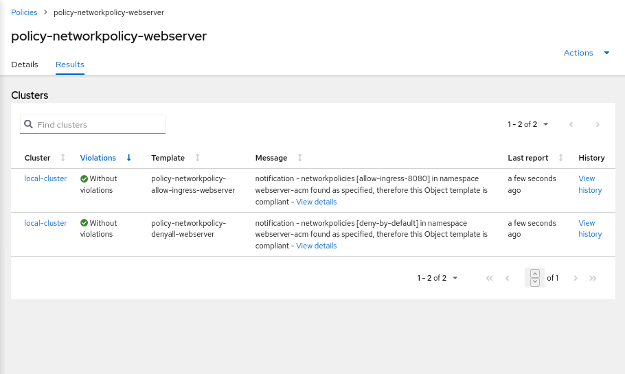
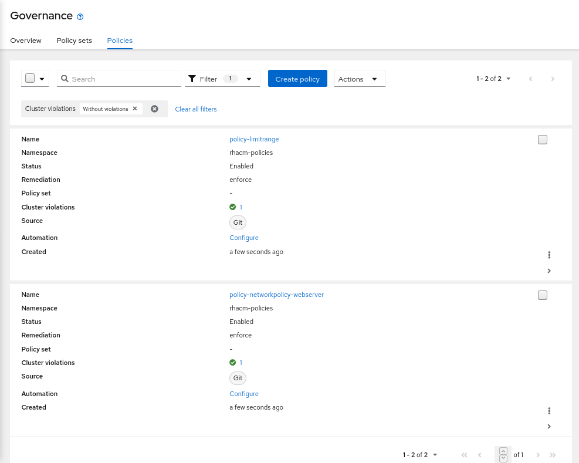

# Exercise 5 - Governance Risk and Compliance

In this exercise you will go through the Compliance features that come with Red Hat Advanced Cluster Management for Kubernetes. You will apply a number of policies to the cluster in order to comply with global security and management standards.

**NOTE!** The exercies depends on the ACM application deployed in the previous exercise (NOT the application deployed using ArgoCD). If the application is not available in your environment, run the next command to deploy it -

```
<hub> $ oc apply -f https://raw.githubusercontent.com/michaelkotelnikov/rhacm-workshop/master/04.Application-Lifecycle/exercise-application/rhacm-resources/application.yaml
```

**NOTE!** Make sure that the `environment=production` label is associated with the managed cluster!

Before you start creating the policies, make sure to create a namespace to populate the CRs that associate with RHACM policies.

```
<hub> $ cat >> policies-namespace.yaml << EOF
---
apiVersion: v1
kind: Namespace
metadata:
  name: rhacm-policies
EOF

<hub> $ oc apply -f policies-namespace.yaml
```

After the namespace is created, create a PlacementRule resource. We will use the PlacementRule to associate the below policies with all clusters that are associated with the environment=production label.

```
<hub> $ cat >> placementrule-policies.yaml << EOF
---
apiVersion: apps.open-cluster-management.io/v1
kind: PlacementRule
metadata:
  name: prod-policies-clusters
  namespace: rhacm-policies
spec:
  clusterConditions:
    - type: ManagedClusterConditionAvailable
      status: "True"
  clusterSelector:
    matchLabels:
      environment: production
EOF

<hub> $ oc apply -f placementrule-policies.yaml
```

## Policy #1 - Network Security

In this section you will apply a NetworkPolicy object onto the cluster in order to limit access to the application you have created in the previous exercise. You will only allow traffic that comes from OpenShift’s Ingress Controller in port 8080. All other traffic will be dropped.

The policy you’ll create in this section will use the _enforce_ remediation action in order to create the NetworkPolicy objects if they do not exist.

We will configure the policy definition in two stages -


### Stage 1 - Deny all traffic to the application namespace

The policy you will configure in this section is enforcing a _deny all_ NetworkPolicy in the webserver-acm namespace on the managed cluster. A _deny all_ NetworkPolicy object example -

```
kind: NetworkPolicy
apiVersion: networking.k8s.io/v1
metadata:
  name: deny-by-default
spec:
  podSelector:
  ingress: []
```

In order to create a _deny all_ NetworkPolicy object on the managed cluster using Red Hat Advanced Cluster Management for Kubernetes, apply the next commands to the hub cluster -

```
<hub> $ cat >> denyall-networkpolicy-policy.yaml << EOF
---
apiVersion: policy.open-cluster-management.io/v1
kind: Policy
metadata:
  name: policy-networkpolicy-webserver
  namespace: rhacm-policies
  annotations:
    policy.open-cluster-management.io/standards: NIST SP 800-53
    policy.open-cluster-management.io/categories: SC System and Communications Protection
    policy.open-cluster-management.io/controls: SC-7 Boundary Protection
spec:
  remediationAction: enforce
  disabled: false
  policy-templates:
    - objectDefinition:
        apiVersion: policy.open-cluster-management.io/v1
        kind: ConfigurationPolicy
        metadata:
          name: policy-networkpolicy-denyall-webserver
        spec:
          remediationAction: enforce # the policy-template spec.remediationAction is overridden by the preceding parameter value for spec.remediationAction.
          severity: medium
          namespaceSelector:
            include: ["webserver-acm"]
          object-templates:
            - complianceType: musthave
              objectDefinition:
                kind: NetworkPolicy
                apiVersion: networking.k8s.io/v1
                metadata:
                  name: deny-by-default
                spec:
                  podSelector:
                  ingress: []
---
apiVersion: policy.open-cluster-management.io/v1
kind: PlacementBinding
metadata:
  name: binding-policy-networkpolicy-webserver
  namespace: rhacm-policies
placementRef:
  name: prod-policies-clusters
  kind: PlacementRule
  apiGroup: apps.open-cluster-management.io
subjects:
- name: policy-networkpolicy-webserver
  kind: Policy
  apiGroup: policy.open-cluster-management.io
EOF

<hub> $ oc apply -f denyall-networkpolicy-policy.yaml
```

The above command creates two objects _Policy_ and _PlacementBinding_.

* The _Policy_ objects define the NetworkPolicy that will be deployed on the managed cluster. It associates the NetworkPolicy to the webserver-acm namespace, and enforces it.
* The _PlacementRule_ resource associates the _Policy_ object with the _PlacementRule _resource that was created in the beginning of the exercise. Thereby, allowing the Policy to apply to all clusters with the _environment=production_ label.

After the creation of the objects, navigate to **Governance Risk and Compliance** in the Red Hat Advanced Cluster Management for Kubernetes console. Note that the policy is configured, and the managed cluster is compliant.

Make sure that the policy is effective by trying to navigate to the application once again - **https://&lt;webserver application route>/application.html**. (The application should not be accessible).

### Stage 2 - Allow traffic from the Ingress Controller

In this section, you will modify the policy you have created in the previous section. You will add another ObjectDefinition entry to the policy. The ObjectDefinition will apply a second NetworkPolicy object onto the webserver-acm namespace in the managed cluster. The NetworkPolicy object will allow traffic from the Ingress Controller to reach the webserver application in port 8080. An example definition of the NetworkPolicy object -

```
apiVersion: networking.k8s.io/v1
kind: NetworkPolicy
metadata:
  name: allow-from-openshift-ingress
spec:
  ingress:
  - ports:
    - protocol: TCP
      port: 8080
  - from:
    - namespaceSelector:
        matchLabels:
          network.openshift.io/policy-group: ingress
  podSelector: {}
  policyTypes:
  - Ingress
```

Adding the NetworkPolicy to the existing policy can be done by running the next command -

```
<hub> $ cat >> networkpolicy-policy.yaml << EOF
---
apiVersion: policy.open-cluster-management.io/v1
kind: Policy
metadata:
  name: policy-networkpolicy-webserver
  namespace: rhacm-policies
  annotations:
    policy.open-cluster-management.io/standards: NIST SP 800-53
    policy.open-cluster-management.io/categories: SC System and Communications Protection
    policy.open-cluster-management.io/controls: SC-7 Boundary Protection
spec:
  remediationAction: enforce
  disabled: false
  policy-templates:
    - objectDefinition:
        apiVersion: policy.open-cluster-management.io/v1
        kind: ConfigurationPolicy
        metadata:
          name: policy-networkpolicy-denyall-webserver
        spec:
          remediationAction: enforce # the policy-template spec.remediationAction is overridden by the preceding parameter value for spec.remediationAction.
          severity: medium
          namespaceSelector:
            include: ["webserver-acm"]
          object-templates:
            - complianceType: musthave
              objectDefinition:
                kind: NetworkPolicy
                apiVersion: networking.k8s.io/v1
                metadata:
                  name: deny-by-default
                spec:
                  podSelector:
                  ingress: []
    - objectDefinition:
        apiVersion: policy.open-cluster-management.io/v1
        kind: ConfigurationPolicy
        metadata:
          name: policy-networkpolicy-allow-ingress-webserver
        spec:
          remediationAction: enforce # the policy-template spec.remediationAction is overridden by the preceding parameter value for spec.remediationAction.
          severity: medium
          namespaceSelector:
            include: ["webserver-acm"]
          object-templates:
            - complianceType: musthave
              objectDefinition:
                kind: NetworkPolicy
                apiVersion: networking.k8s.io/v1
                metadata:
                  name: allow-ingress-8080
                spec:
                  ingress:
                  - ports:
                    - protocol: TCP
                      port: 8080
                  - from:
                    - namespaceSelector:
                        matchLabels:
                          network.openshift.io/policy-group: ingress
                  podSelector: {}
                  policyTypes:
                  - Ingress
---
apiVersion: policy.open-cluster-management.io/v1
kind: PlacementBinding
metadata:
  name: binding-policy-networkpolicy-webserver
  namespace: rhacm-policies
placementRef:
  name: prod-policies-clusters
  kind: PlacementRule
  apiGroup: apps.open-cluster-management.io
subjects:
- name: policy-networkpolicy-webserver
  kind: Policy
  apiGroup: policy.open-cluster-management.io
EOF

<hub> $ oc apply -f networkpolicy-policy.yaml
```

After applying the above policy, the application will be reachable from OpenShift’s ingress controller only. Any other traffic will be dropped.

Make sure that the managed cluster is compliant to the policy by navigating to **Governance Risk and Compliance** in the Red Hat Advanced Cluster Management for Kubernetes console.



Make sure that the application is accessible now at - **https://&lt;webserver application route>/application.html**.

## Policy #2 - Quota Management

In this section you will apply a LimitRange object onto the cluster in order to limit the application’s resource consumption. You will configure a LimitRange object that limits the application’s container memory to 512Mb.

The policy you will create defines the next LimitRange object in the webserver-acm namespace -

```
apiVersion: v1
kind: LimitRange # limit memory usage
metadata:
  name: webserver-limit-range
spec:
  limits:
  - default:
      memory: 512Mi
      defaultRequest:
      memory: 256Mi
      type: Container
```

In order to apply the LimitRange object to the managed cluster using Red Hat Advanced Cluster Management for Kubernetes, run the next commands -

```
<hub> $ cat >> limitrange-policy.yaml << EOF
apiVersion: policy.open-cluster-management.io/v1
kind: Policy
metadata:
  name: policy-limitrange
  namespace: rhacm-policies
  annotations:
    policy.open-cluster-management.io/standards: NIST SP 800-53
    policy.open-cluster-management.io/categories: SC System and Communications Protection
    policy.open-cluster-management.io/controls: SC-6 Resource Availability
spec:
  remediationAction: enforce
  disabled: false
  policy-templates:
    - objectDefinition:
        apiVersion: policy.open-cluster-management.io/v1
        kind: ConfigurationPolicy
        metadata:
          name: policy-limitrange-example
        spec:
          remediationAction: enforce # the policy-template spec.remediationAction is overridden by the preceding parameter value for spec.remediationAction.
          severity: medium
          namespaceSelector:
            include: ["webserver-acm"]
          object-templates:
            - complianceType: mustonlyhave
              objectDefinition:
                apiVersion: v1
                kind: LimitRange # limit memory usage
                metadata:
                  name: webserver-limit-range
                spec:
                  limits:
                  - default:
                      memory: 512Mi
                    defaultRequest:
                      memory: 256Mi
                    type: Container
---
apiVersion: policy.open-cluster-management.io/v1
kind: PlacementBinding
metadata:
  name: binding-policy-limitrange
  namespace: rhacm-policies
placementRef:
  name: prod-policies-clusters
  kind: PlacementRule
  apiGroup: apps.open-cluster-management.io
subjects:
- name: policy-limitrange
  kind: Policy
  apiGroup: policy.open-cluster-management.io
EOF

<hub> $ oc apply -f limitrange-policy.yaml
```

Make sure that the managed cluster is compliant to the policy by navigating to **Governance Risk and Compliance** in the Red Hat Advanced Cluster Management for Kubernetes console.

Make sure that the LimitRange object is created in your managed cluster -

* Validate that the LimitRange object is created in the webserver-acm namespace -

```
<managed cluster> $ oc get limitrange webserver-limit-range -o yaml -n webserver-acm
```

As the admin user in the managed cluster, try to modify the values of the LimitRange resource (change the memory limit from 512Mi to 1024Mi) -

```
<managed cluster> $ oc whoami
admin

<managed cluster> $ oc edit limitrange/webserver-limit-range -n webserver-acm
```

Notice that if you list the LimitRange resource again, the value of the memory limit is back to 512Mi. The 1024Mi value was overridden by the Red Hat Advanced Cluster Management’s policy controller. Changing the LimitRange’s values is only possible by editing the Policy object on the hub cluster.

```
<managed cluster> $ oc get limitrange webserver-limit-range -o yaml -n webserver-acm
...
  limits:
  - default:
    memory: 512Mi
...
```

## Policy #3 - Namespace management

In this section, you will create a policy that `informs` if a namespace with the name `rhacm-dangerous-policy-namespace` is present. Make sure to create the policy in the `rhacm-policies` namespace You may use the workshop presentation and the policies you've created in this exercise as a reference for the creation of this policy.

After deploying the policy, make sure that it is in a `compliant` state.

Create a namespace with the `rhacm-dangerous-policy-namespace` name on the managed cluster. Make sure that a violation is initiated.

```
<managed cluster> $ oc create namespace rhacm-dangerous-policy-namespace
```

Change the remediationAction in your policy to `enforce`. The violation should be remediated.

## Using GitOps

In this section you will use RHACM’s built-in GitOps mechanism to manage your policies. You will deploy the above policies, and manage them in a GitOps friendly way.

Before you start this section of the exercise, make sure you delete the namespace containing the policies you used in the previous section.

```
<hub> $ oc delete project rhacm-policies
```

1. For this exercise, create a fork of the next GitHub repository - [https://github.com/michaelkotelnikov/rhacm-workshop](https://github.com/michaelkotelnikov/rhacm-workshop)

    As a result, you will have your own version of the repository - [https://github.com/&lt;your-username>/rhacm-workshop](https://github.com/michaelkotelnikov/rhacm-workshop)

2. Afterwards, create a namespace on which you will deploy the RHACM resources (Use the namespace.yaml file in the forked repository) -

```
<hub> $ oc apply -f https://raw.githubusercontent.com/<your-github-username>/rhacm-workshop/master/05.Governance-Risk-Compliance/exercise/namespace.yaml
```

3. Now, clone the official policy-collection GitHub repository to your machine. The repository contains a binary named **deploy.sh**. The binary is used to associate policies in a GitHub repository to a running Red Hat Advanced Cluster Management for Kubernetes cluster.

```
<hub> $ git clone https://github.com/open-cluster-management/policy-collection.git

<hub> $ cd policy-collection/deploy/
```

4.a. If you are using the kubeadmin user, create an identity provider by running the next commands (It is not possible to create policies via GitOps using the kubeadmin user). The identity provider will create the `workshop-admin` user -

```
<hub> $ htpasswd -c -B -b htpasswd workshop-admin redhat

<hub> $ oc create secret generic localusers --from-file htpasswd=htpasswd -n openshift-config

<hub> $ oc adm policy add-cluster-role-to-user cluster-admin workshop-admin

<hub> $ oc get -o yaml oauth cluster > oauth.yaml
```

4.b. Edit the `oauth.yaml` file. The result should look like -

```
apiVersion: config.openshift.io/v1
kind: OAuth
...output omitted...
spec:
  identityProviders:
  - htpasswd:
      fileData:
        name: localusers
    mappingMethod: claim
    name: local-users
    type: HTPasswd
```

4.c. Replace the cluster's identity provder by running the next command -

```
<hub> $ oc replace -f oauth.yaml
```

4.d. Login with the created user -

```
<hub> $ oc login -u workshop-admin -p redhat
```

5. Run the next command to allow your username deploy policies via Git (If you're not using the `workshop-admin` user to run the command, make sure to edit the command in order to associate your user with the `subscription-admin` ClusterRole. Make sure to run the command even if you are using an administrative user!) -

```
<hub> $ oc patch clusterrolebinding.rbac open-cluster-management:subscription-admin -p '{"subjects": [{"apiGroup":"rbac.authorization.k8s.io", "kind":"User", "name":"workshop-admin"}]}'
```

6. You can now deploy the policies from your forked repository to Advanced Cluster Management.

```
<hub> $ ./deploy.sh --url https://github.com/<your-github-username>/rhacm-workshop.git --branch master --path 05.Governance-Risk-Compliance/exercise/exercise-policies --namespace rhacm-policies
```

7. Make sure that the policies are deployed in the **Governance Risk and Compliance** tab in the Advanced Cluster Management for Kubernetes console.




8. Edit the LimitRange policy in [https://github.com/&lt;your-username>/rhacm-workshop/blob/master/05.Governance-Risk-Compliance/exercise/exercise-policies/limitrange-policy.yaml](https://github.com/michaelkotelnikov/rhacm-workshop/blob/master/05.Governance-Risk-Compliance/exercise/exercise-policies/limitrange-policy.yaml). Change the default container limit from 512Mi to 1024Mi.

9. Make sure that you commit, and push the change to your fork.

10. Log into managed cluster. Make sure that the change in GitHub was applied to the LimitRange resource.

```
<managed cluster> $ oc get limitrange webserver-limit-range -o yaml -n webserver-acm
...
  limits:
  - default:
    memory: 1Gi
...
```

## Templating Policies

In this section you will use RHACM's templating mechanism for governance policies. In this scenario, you will create an RHACM application. The application deploys a mariadb database and a Prometheus exporter ([mysqld-exporter](https://github.com/prometheus/mysqld_exporter)) that connects to the database and exports metrics.

The mysqld-exporter requires mariadb's connection information in order to connect to the database and export the metrics. Since secrets like _database passwords_ can be automatically generated in production environments, it might be required to use a dynamic template that passes such information to the exporter's configuration.

In this scenario, you will pass two templated variables to the mysqld-exporter deployment using a dedicated ConfigMap resource. The variables are merged into a single *connection string* that the exporter uses to connect to the mariadb database.

- _mariadb Service endpoint_ - The ConfigMap will populate the mariadb Service resource ClusterIP dynamically. The service endpoint might be different between managed clusters, using a template in this scenario can help the stability of the system. The `lookup` function is used to identify the service's ClusterIP - `{{ (lookup "v1" "Service" "mariadb-metrics" "mariadb").spec.clusterIP }}`.
- _mariadb Root password_ - The ConfigMap will provide the connection password dynamically. The password can be different for database instances in multi cluster environments. Using a template in this scenario can solve inconsistencies between clusters. The `fromSecret` function is used to pull the password from mariadb's secret - `{{ fromSecret "mariadb-metrics" "mariadb" "MYSQL_ROOT_PASSWORD"}}`

To further understand the structure of the application, go over the [application resources](exercise/exercise-application). All of the application resources are present in this directory besides the ConfigMap resource which is created using a templated policy.

The next [templated policy](exercise/exercise-templates/metrics-configmap.yaml) is used to create the ConfigMap resource that the exporter uses as a connection string - 

```
kind: ConfigMap
apiVersion: v1
metadata:
  name: metrics-connection-string
  namespace: mariadb-metrics
data:
  connection_string: 'root:{{ fromSecret "mariadb-metrics" "mariadb" "MYSQL_ROOT_PASSWORD"}}@({{ (lookup "v1" "Service" "mariadb-metrics" "mariadb").spec.clusterIP }}:3306)/'
```

Deploy the templated policy by running the next command on the hub cluster -

```
<hub> $ oc apply -f https://raw.githubusercontent.com/michaelkotelnikov/rhacm-workshop/master/05.Governance-Risk-Compliance/exercise/exercise-templates/metrics-configmap.yaml
```

The policy will appear at the Governance dashboard at a non-compliant state. The policy depends on the `mariadb` Secret resource and the `mariadb` Service resource. Since you have not created them yet, the policy is not able to create the desired ConfigMap resource.

Deploy the mariadb-metrics application in order to create the mariadb and exporter instances. Deploy the application by running the next command -

```
<hub> $ oc apply -f https://raw.githubusercontent.com/michaelkotelnikov/rhacm-workshop/master/05.Governance-Risk-Compliance/exercise/exercise-application/rhacm-resources/application.yaml
```

Wait until the application is available. After the application is available, make sure that the policy you have deployed is compliant in the Governance dashboard. Make sure that the template worked by running the next command on the managed cluster.

```
<managed cluster> $ oc get configmap metrics-connection-string -o yaml -n mariadb-metrics
apiVersion: v1
data:
  connection_string: root:cmVkaGF0@(172.30.14.60:3306)/
kind: ConfigMap
metadata:
  name: metrics-connection-string
  namespace: mariadb-metrics
```

Navigate to the URL exported by the `Route` resource in the `mariadb-metrics` namespace. The `Route` exposes the mariadb metrics from the exporter instance.

```
<managed cluster> $ oc get route -n mariadb-metrics
NAME              HOST/PORT                                                                       PATH   SERVICES          PORT       TERMINATION   WILDCARD
mysqld-exporter   mysqld-exporter-mariadb-metrics.apps.cluster-6f0a.6f0a.sandbox664.opentlc.com          mysqld-exporter   9104-tcp   edge          None
```

Mariadb metrics are presented by running the next command -

```
<managed cluster> $ curl https://<route>/metrics -k
...
# HELP go_memstats_heap_inuse_bytes Number of heap bytes that are in use.
# TYPE go_memstats_heap_inuse_bytes gauge
go_memstats_heap_inuse_bytes 3.80928e+06
# HELP go_memstats_heap_objects Number of allocated objects.
# TYPE go_memstats_heap_objects gauge
go_memstats_heap_objects 7487
# HELP go_memstats_heap_released_bytes Number of heap bytes released to OS.
# TYPE go_memstats_heap_released_bytes gauge
go_memstats_heap_released_bytes 6.270976e+07
# HELP go_memstats_heap_sys_bytes Number of heap bytes obtained from system.
# TYPE go_memstats_heap_sys_bytes gauge
go_memstats_heap_sys_bytes 6.668288e+07
# HELP go_memstats_last_gc_time_seconds Number of seconds since 1970 of last garbage collection.
# TYPE go_memstats_last_gc_time_seconds gauge
go_memstats_last_gc_time_seconds 0
# HELP go_memstats_lookups_total Total number of pointer lookups.
# TYPE go_memstats_lookups_total counter
go_memstats_lookups_total 0
# HELP go_memstats_mallocs_total Total number of mallocs.
# TYPE go_memstats_mallocs_total counter
go_memstats_mallocs_total 8093
# HELP go_memstats_mcache_inuse_bytes Number of bytes in use by mcache structures.
# TYPE go_memstats_mcache_inuse_bytes gauge
go_memstats_mcache_inuse_bytes 19200
# HELP go_memstats_mcache_sys_bytes Number of bytes used for mcache structures obtained from system.
# TYPE go_memstats_mcache_sys_bytes gauge
go_memstats_mcache_sys_bytes 32768
# HELP go_memstats_mspan_inuse_bytes Number of bytes in use by mspan structures.
# TYPE go_memstats_mspan_inuse_bytes gauge
go_memstats_mspan_inuse_bytes 63376
# HELP go_memstats_mspan_sys_bytes Number of bytes used for mspan structures obtained from system.
# TYPE go_memstats_mspan_sys_bytes gauge
go_memstats_mspan_sys_bytes 65536
# HELP go_memstats_next_gc_bytes Number of heap bytes when next garbage collection will take place.
# TYPE go_memstats_next_gc_bytes gauge
go_memstats_next_gc_bytes 4.473924e+06
...
```
