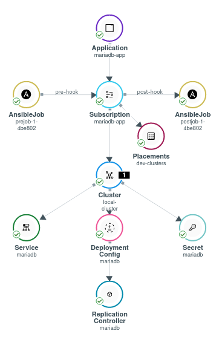
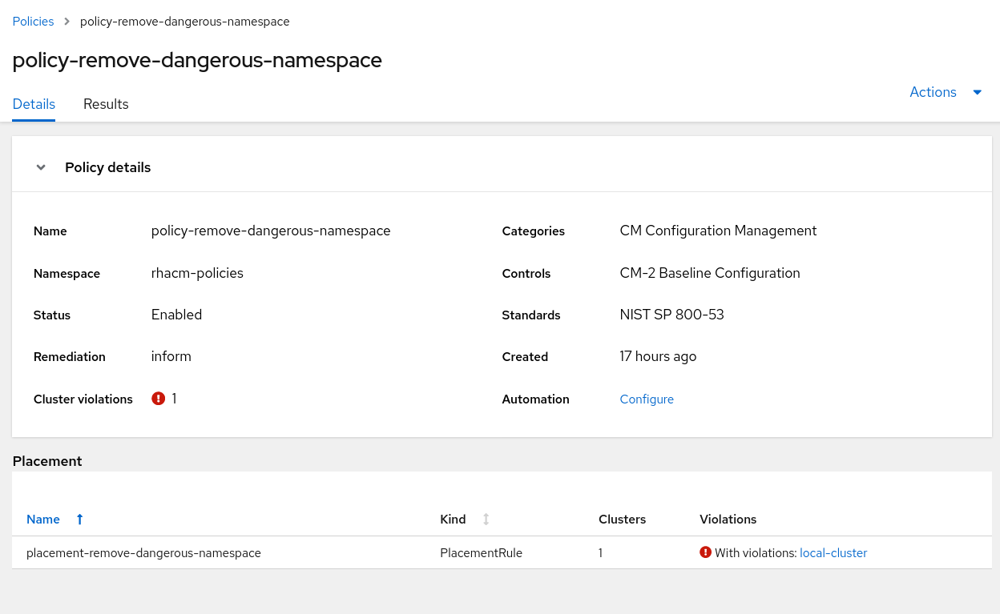
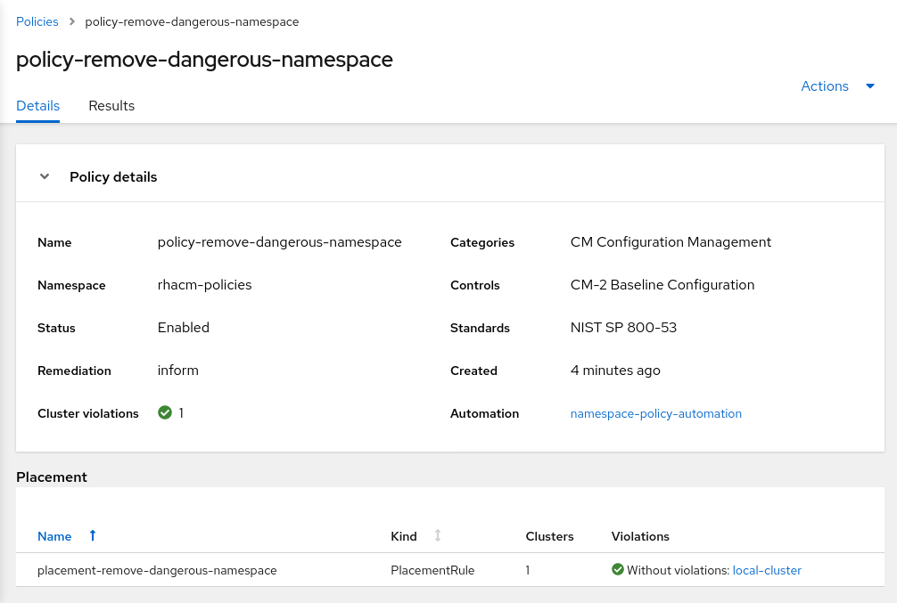

# Exercise 7 - Ansible Tower Integration

In this exercise you will go through Ansible Tower integration with Red Hat Advanced Cluster Management for Kubernetes. You will associate AnsibleJob hooks to applications and integrate AnsibleJobs with policy violations. Ansible Tower has already been configured for your use by the instructor. You will only configure Red Hat Advanced Cluster Management for Kubernetes.

The instructor will provide you with -

* Ansible Tower URL
* Ansible Tower web UI username / password
* Ansible Tower Access Token for API requests

## Before You Begin

In this section you will create the basic integration between RHACM and Ansible Tower. The integration is based on `Ansible Automation Platform Resource Operator`. Make sure to install the operator before you begin the next exercises.

Installing the operator can be done by running the next commands on the hub cluster -

```
<hub> $ oc create namespace ansible-resource-operator

<hub> $ cat >> ansible-operator.yaml << EOF
---
apiVersion: operators.coreos.com/v1alpha1
kind: Subscription
metadata:
  name: awx-resource-operator
  namespace: ansible-resource-operator
spec:
  channel: release-0.1
  installPlanApproval: Automatic
  name: awx-resource-operator
  source: redhat-operators
  sourceNamespace: openshift-marketplace
  startingCSV: awx-resource-operator.v0.1.1
EOF

<hub> $ oc apply -f ansible-operator.yaml
```

The operator will now begin the installation process.

## Ansible Tower Application Integration

In this section, you will configure Ansible Tower Jobs to run as your RHACM Application deploys. The first job will run as a _prehook_ while the second job will run as a _posthook_. The _prehook_ runs before the application resources start the deployment process while the _posthook_ job runs as soon as the resources are deployed.

Both Ansible Job hooks initiate the same Job Template on Ansible Tower called _Logger_. The _Logger_ Job Template creates a log in a dedicated file for each initiation of the Job Template. Afterwards, the _Logger_ Job Template exposes the log file on a local web server on Ansible Tower.

The participants can view all log files on the Ansible Tower server by navigating to the URL provided by the instructor in **port 80**.

The _Logger_ Ansible Role can be found at [logger role](ansible-playbooks/roles/logger) directory.

### Setting up Authentication

In order to allow RHACM to access Ansible Tower you must set up a Namespace scoped secret for RHACM to use. RHACM uses the secret to authenticate against the Ansible Tower instance. The secret contains the Ansible Tower URL and Access Token.

Before creating the secret itself, make sure the namespace that populates the secret exists by running the next command on the **hub** cluster -

```
<hub> $ oc create namespace mariadb
```

To create the secret, navigate to **Credentials** -> **Add credentials** -> **Red Hat Ansible Automation Platform** in the RHACM UI and fill the next fields -

- Credentials name: **ansible-tower**
- Namespace: **mariadb**

Press **Next**.

At the next screen, specify the **Ansible Tower host** and **Ansible Tower token** provided by the instructor.

Press **Next**. Review the information, and press on **Add**.

### Setting up the Application

Before you continue, create a fork of the next GitHub repository - [https://github.com/michaelkotelnikov/rhacm-workshop](https://github.com/michaelkotelnikov/rhacm-workshop). As a result, you will have your own version of the repository - [https://github.com/&lt;your-username>/rhacm-workshop](https://github.com/michaelkotelnikov/rhacm-workshop).

Change the `log_file_name` variable value from `rhacm.log` to `<your-name>.log` (e.g `michael.log`) in the [prehook](demo-application/mariadb-resources/prehook/pre_log.yaml) and [posthook](demo-application/mariadb-resources/posthook/post_log.yaml) definition in **your fork** of the repository.

Change the `pathname` definition in the Channel resource in the [application.yml](demo-application/rhacm-resources/application.yml) file in **your fork** of the repository. Change the `pathname` value from `https://github.com/michaelkotelnikov/rhacm-workshop.git` to `https://github.com/<your-username>/rhacm-workshop.git` (**Make sure to update <your-username> to the real name**).

Apply the application resources from **your fork** -

```
<hub> $ oc apply -f https://raw.githubusercontent.com/<your-username>/rhacm-workshop/master/07.Ansible-Tower-Integration/demo-application/rhacm-resources/application.yml
```

Navigate to **Applications** -> **mariadb-app** in RHACM's UI. Note that the application has been deployed successfully alongside its pre and post hooks.



If you navigate to `http://<ansible-tower-url>/logs/<your-name>.log` you will notice the output of the Logger Ansible Job Template.

```
Wed Sep 29 16:20:27 UTC 2021 Ansible Job was triggered by mariadb as prehook in clusters ['local-cluster'].
Wed Sep 29 16:21:19 UTC 2021 Ansible Job was triggered by mariadb as posthook in clusters ['local-cluster'].
```

Note that the posthook executed ~1 min after the prehook.

Run the next commands to see more information about the executed AnsibleJobs. Each AnsibleJob instance has valubale information for troubleshooting and diagnostics -

```
<hub> $ oc get ansiblejob -n mariadb

NAME               AGE
postjob-1-4be802   13m
prejob-1-4be802    15m

<hub> $ oc describe ansiblejob prejob-1-4be802 -n mariadb

Name:         prejob-1-4be802
Namespace:    mariadb
Labels:       tower_job_id=13
Annotations:  apps.open-cluster-management.io/hook-type: prehook
              apps.open-cluster-management.io/hosting-subscription: mariadb/mariadb-app
API Version:  tower.ansible.com/v1alpha1
Kind:         AnsibleJob
Metadata:
    Manager:    OpenAPI-Generator
    Operation:  Update
    Time:       2021-09-29T16:20:30Z
  Owner References:
    API Version:     apps.open-cluster-management.io/v1
    Kind:            Subscription
    Name:            mariadb-app
    UID:             d5207886-dc95-4668-a96c-d7cc6468e079
  Resource Version:  513833
  UID:               0314f132-3495-4328-b84c-2d6815d25f5e
Spec:
  extra_vars:
    hook_type:      prehook
    log_file_name:  michael.log
    target_clusters:
      local-cluster
    trigger_name:     mariadb
  job_template_name:  Logger
  tower_auth_secret:  ansible-tower
Status:
  Ansible Job Result:
    Changed:   true
    Elapsed:   6.197
    Failed:    false
    Finished:  2021-09-29T16:20:28.465789Z
    Started:   2021-09-29T16:20:22.268481Z
    Status:    successful
    URL:       https://student1.a32d.example.opentlc.com/#/jobs/playbook/13
  Conditions:
    Ansible Result:
      Changed:             0
      Completion:          2021-09-29T16:20:37.920281
      Failures:            0
      Ok:                  3
      Skipped:             0
    Last Transition Time:  2021-09-29T16:19:08Z
    Message:               Awaiting next reconciliation
    Reason:                Successful
    Status:                True
    Type:                  Running
  k8sJob:
    Created:  true
    Env:
      Secret Namespaced Name:  mariadb/ansible-tower
      Template Name:           Logger
      Verify SSL:              false
    Message:                   Monitor the job.batch status for more details with the following commands:
'kubectl -n mariadb get job.batch/prejob-1-4be802'
'kubectl -n mariadb describe job.batch/prejob-1-4be802'
'kubectl -n mariadb logs -f job.batch/prejob-1-4be802'
    Namespaced Name:  mariadb/prejob-1-4be802
  Message:            This job instance is already running or has reached its end state.
Events:               <none>
```

More information can be found in the Ansible Tower UI. Log into the Ansible Tower UI using the URL and credentials provided by the instructor.

At the main dashboard, take a look at the **Recent Job Runs** tab. Press on the `Logger` Job Run that matches your timestamp.


### Updating an Application

Now that you have seen how Ansible Tower integrates with RHACM Applications, let's add another resource to the application. Adding a resource to the application demonstrates how AnsibleJobs are affected by changes in the application structure.

In **your fork** of this repository, add a file called `service.yaml` under the [mariadb-resources](./mariadb-resources) directory. Paste the next resource to the `service.yaml` file. Make sure to commit the changes to GitHub.

```
apiVersion: v1
kind: Service
metadata:
  labels:
    app: mariadb
  name: mariadb
  namespace: mariadb
spec:
  ports:
  - name: 3306-tcp
    port: 3306
    protocol: TCP
    targetPort: 3306
  selector:
    app: mariadb
  sessionAffinity: None
  type: ClusterIP
```

Note that after applying the resource, more AnsibleJob resources have been created in the `mariadb` namespace.

```
<hub> $ oc get ansiblejob

NAME               AGE
postjob-1-d53c95   3m18s
postjob-1-e18776   28m
prejob-1-d53c95    3m59s
prejob-1-e18776    28m
```

The first AnsibleJob ran before applying the new Service resource, while the second one ran after applying it.

If you take a look at the log file created by Ansible Tower at `http://<ansible-tower-url>/logs/<your-name>.log` you'll notice the **new** logs that the Logger Job Template has created. Note the timestamp of the latest logs in the file.

```
Wed Sep 29 16:20:27 UTC 2021 Ansible Job was triggered by mariadb as prehook in clusters ['local-cluster'].
Wed Sep 29 16:21:19 UTC 2021 Ansible Job was triggered by mariadb as posthook in clusters ['local-cluster'].
Wed Sep 29 17:20:57 UTC 2021 Ansible Job was triggered by mariadb as prehook in clusters ['local-cluster'].
Wed Sep 29 17:21:49 UTC 2021 Ansible Job was triggered by mariadb as posthook in clusters ['local-cluster'].
```

## Ansible Tower Governance Integration

In this section, you will configure Ansible Tower Jobs to run as a violation is initiated in one of your policies.

### Setting up Authentication

In order to allow RHACM to access Ansible Tower you must set up a **Namespace scoped** secret for RHACM to use. A secret must be created for each namespace that interacts with Ansible Tower. Therefore, you must create the secret in the namespace that containts the policies as well.

Before creating the secret itself, make sure the namespace that populates the secret exists by running the next command -

```
<hub> $ oc create namespace rhacm-policies
```

To create the secret, navigate to **Credentials** -> **Red Hat Ansible Automation Platform** in the RHACM UI and fill the next fields -

- Credentials name: **ansible-tower**
- Namespace: **rhacm-policies**

Press **Next**.

At the next screen, specify the **Ansible Tower host** and **Ansible Tower token** provided by the instructor.

Press **Next**. Review the information, and press on **Add**.

### Policy Automation - #1 - Delete Namespace if violation initiates

In this example you will create a policy that monitors whether a _forbidden namespace_ exists. If the namespace exists a violation will be initiated. Once the violation is initiated an Ansible Job Template will be triggered. The Ansible Job Template will remediate the violation using an Ansible role. A role has already been configured for this scenario at - [ansible-playbooks/roles/k8s-namespace](ansible-playbooks/roles/k8s-namespace).

#### Configuring the Policy

The next Policy will initiate an alert if a namespace with the name `forbidden-namespace` is present in the cluster. Apply the policy to the hub cluster -

```
<hub> $ oc apply -f https://raw.githubusercontent.com/michaelkotelnikov/rhacm-workshop/master/07.Ansible-Tower-Integration/demo-policy/rhacm-resources/policy.yaml
```

After creating the policy, make sure that the policy works as expected. Create a namespace with the name `forbidden-namespace`, on the managed cluster.

```
<managed cluster> $ oc create namespace forbidden-namespace
```

 Make sure that a violation is initiated.

 

 #### Configuring PolicyAutomation

 Now that a policy is configured, create a PolicyAutomation object that will initiate an Ansible Job that will remediate the violation. Copy the next PolicyAutomation object definition to your local workstation.

 ```
apiVersion: policy.open-cluster-management.io/v1beta1
kind: PolicyAutomation
metadata:
  name: namespace-policy-automation
  namespace: rhacm-policies
spec:
  automationDef:
    extra_vars:
      k8s_api_url: <K8S API server URL>
      k8s_password: <K8S password>
      k8s_username: <K8S username>
    name: K8S-Namespace
    secret: ansible-tower
    type: AnsibleJob
  mode: once
  policyRef: policy-remove-dangerous-namespace
 ```

 Modify the PolicyAutomation object with parameters relevant to your cluster.

 - k8s_api_url refers to the API URL of your **managed** OpenShift / K8S cluster. e.g - 'https://api.cluster.sandbox.opentlc.com:6443'
 - k8s_password refers to the password you're going to use to authenticate to the **managed** OpenShift / K8S cluster.
 - k8s_username refers to the username you're going to use to authenticate to the **managed** OpenShift / K8S cluster.

 After modifying the parametes, create the PolicyAutomation object on the hub cluster in the `rhacm-policies` namespace.

 Note that as soon as you create the PolicyAutomatiob object, an AnsibleJob object is created in the `rhacm-policies` namespace. The AnsibleJob marks that the Ansible Job Template on Ansible Tower has been initiated.

 ```
<hub> $ oc get ansiblejob -n rhacm-policies

NAME                                               AGE
namespace-policy-automation-once-2bgv8             46s
 ```

 If you log into the Ansible Tower web interface, you'll notice that the K8S-Namespace Job Template has been initiated. The Job indicates that the forbidden namespace has been removed.

 

 Now, take a look at the Governance dashboard in RHACM. Note that the violation is no longer present in the policy you have created. The forbidden namespace is no longer present.

 